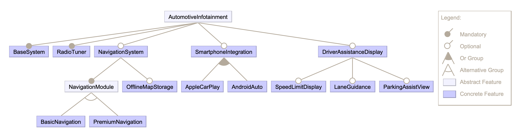

# Car Infotainment System Example

A set of examples demonstrating the value of NeoJoins param feature, using a sample Car Infotainment System scenario with the following Feature Model:



## Structure

- metamodels - various metamodels (in ecore format) used in the example
- instances - XMI model instances, including the feature model
- parameters - XMI files defining the Basic and Comfort configurations - used as parameters in the NeoJoin queries
- queries - sample NeoJoin queries
- dagram - an Eclipse / FeatureIDE project for visualisation of the feature diagram

## Examples

### Example 1

All components — no parameter

- Shows the problem: without a parameter, all 19 blocks from the 150% model appear, including components for unselected features like NavigationSystem and ADAS.
- A software engineer requesting the Base Model BOM would get incorrect results.

Run:

```neojoin car-infotainment/queries/all_sysml_blocks.nj -m car-infotainment/metamodels -i car-infotainment/instances -t all_components_result.xmi```


### Example 2

Bill of Materials for a product configuration / selection of features
- Demonstrates the `param` keyword solving the SPL filtering problem.
- The `activeFeatures` parameter receives the selected features for a specific product configuration.

- When executed with Base Model (`features_base_model.xmi`) as a parameter -> 9 blocks (BaseSystem + RadioTuner + SmartphoneIntegration + AppleCarPlay + AndroidAuto)
- When executed with Comfort Model (`features_comfort_model.xmi`) as a parameter -> 13 blocks (adds NavigationSystem + BasicNavigation + OfflineMapStorage + DriverAssistanceDisplay)

Run

```neojoin car-infotainment/queries/bom_by_feature_list.nj -m car-infotainment/metamodels -i car-infotainment/instances -p activeFeatures=car-infotainment/parameters/features_base_model.xmi -t bom_for_featureList_result.xmi```

```neojoin car-infotainment/queries/bom_by_feature_list.nj -m car-infotainment/metamodels -i car-infotainment/instances -p activeFeatures=car-infotainment/parameters/features_comfort_model.xmi -t bom_for_featureList_result.xmi```


### Example 3

Bill of Materials for a product configuration

- Demonstrates the `param` keyword solving the SPL filtering problem, using a Configuration as input
- The param `activeConfig` receives the specific configuration as xmi

Run

```neojoin car-infotainment/queries/bom_by_configuration.nj -m car-infotainment/metamodels -i car-infotainment/instances -p activeConfig=car-infotainment/parameters/config_base_model.xmi -t bom_using_config_result.xmi```

### Example 4

Components (SysML blocks) implementing a specific feature

Shows all SysML blocks that belong to one named feature module.
Useful for a developer or team responsible for a specific feature.

- Run with `featureName=NavigationSystem` -> INavigationService, NavigationService
- Run with `featureName=BasicNavigation` -> BasicMapRenderer
- Run with `featureName=PremiumNavigation` -> PremiumMapRenderer

Run

```neojoin car-infotainment/queries/blocks_for_feature.nj -m car-infotainment/metamodels -i car-infotainment/instances -p featureName=NavigationSystem -t components_for_feature_result.xmiß```

```neojoin car-infotainment/queries/blocks_for_feature.nj -m car-infotainment/metamodels -i car-infotainment/instances -p featureName=BasicNavigation -t components_for_feature_result.xmi```

```neojoin car-infotainment/queries/blocks_for_feature.nj -m car-infotainment/metamodels -i car-infotainment/instances -p featureName=PremiumNavigation -t components_for_feature_result.xmi```


### Example 5

Feature traceability view

Produces a view that joins all three domain models in a single query, infusing the result with SPL variability information. 

Filtered to the selected list of features, so only relevant mappings appear.

Run

```neojoin car-infotainment/queries/feature_traceability.nj -m car-infotainment/metamodels -i car-infotainment/instances -p activeFeatures=car-infotainment/parameters/features_base_model.xmi -t feature_traceability_result.xmi```